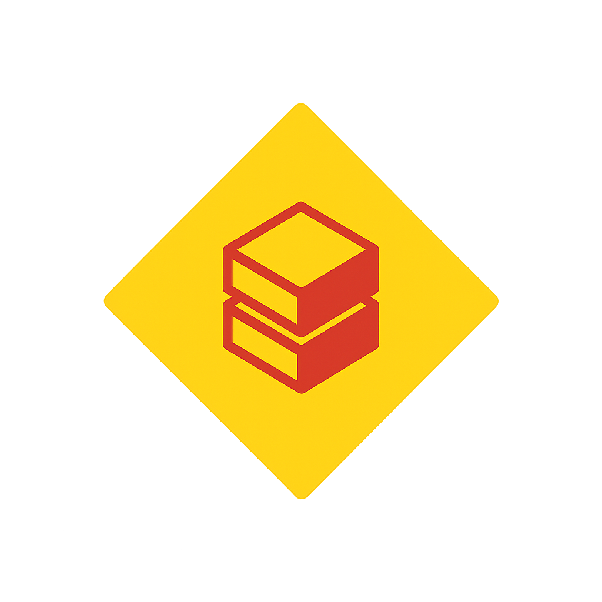

  

Kedro plugin to develop Kedro pipelines for Databricks. This plugin strives to provide the ultimate developer experience when using Kedro on Databricks.

## Key Features

1. **Initialization**: Transform your local Kedro project into a Databricks Asset Bundle.
2. **Generation**: Generate Asset Bundle resources definition based from your kedro pipelines.
3. **Deployment**: Deploy your Kedro pipelines to Databricks as Workflows.
4. **Execution**: Run your Kedro pipelines on Databricks straight from the command line.
5. **Cleanup**: Remove all Databricks resources created by the plugin.
